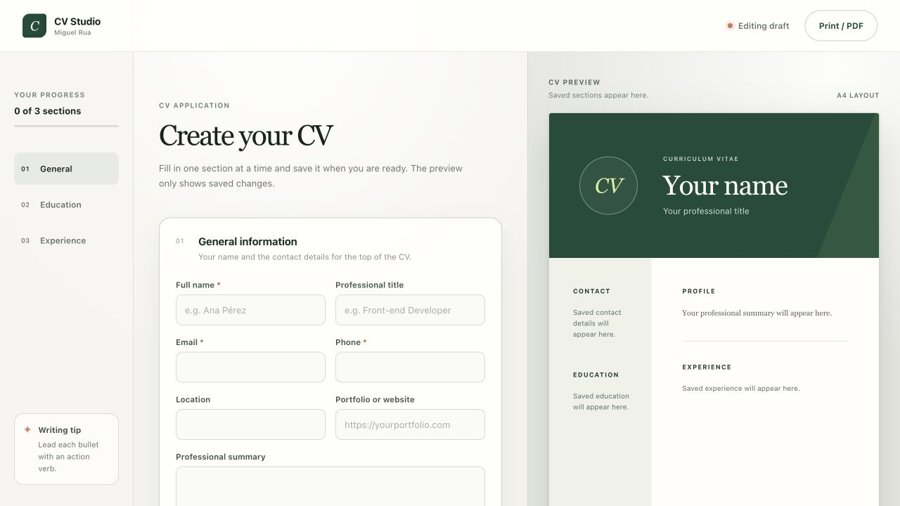

# CV Studio

My solution to [The Odin Project's CV Application assignment](https://www.theodinproject.com/). It lets users enter general, education, and work information, review the saved details as a CV, and return to edit each section.

[Live demo](https://miguelrcol.github.io/cv-studio/) · [Build status](https://github.com/MiguelRcol/cv-studio/actions/workflows/deploy.yml)



## Features

- Separate edit and save controls for general information, education, and experience
- Section navigation with completion progress
- Add, remove, and undo controls for education and work entries
- Date validation for education and experience ranges
- A live CV preview that changes only after a section is saved
- Responsive layouts for desktop and mobile screens
- Browser print styles for saving the CV as a PDF
- Labels, keyboard focus styles, semantic HTML, and status announcements
- Runs entirely in the browser, with no account or backend

## What I practiced

- Controlled React form fields
- Passing typed data through props
- Keeping draft state separate from submitted state
- Updating arrays without mutating state
- Conditional rendering for edit and preview modes
- Testing form interactions with Vitest and Testing Library

The assignment requires React. I chose TypeScript so I could also practice typing component props and state objects; it does not change the assignment's React concepts.

## Running locally

```bash
git clone https://github.com/MiguelRcol/cv-studio.git
cd cv-studio
npm install
npm run dev
```

Vite will print the local development URL in the terminal.

## Checks

```bash
npm run check
```

This command runs ESLint, the interaction tests, TypeScript validation, and a production build.

## Current limitation

The CV data lives in React state and resets when the page is refreshed. Local storage would be a useful next improvement.

## Deployment

Pushes to `main` are checked and deployed to GitHub Pages with GitHub Actions.

## License

Released under the [MIT License](LICENSE).
