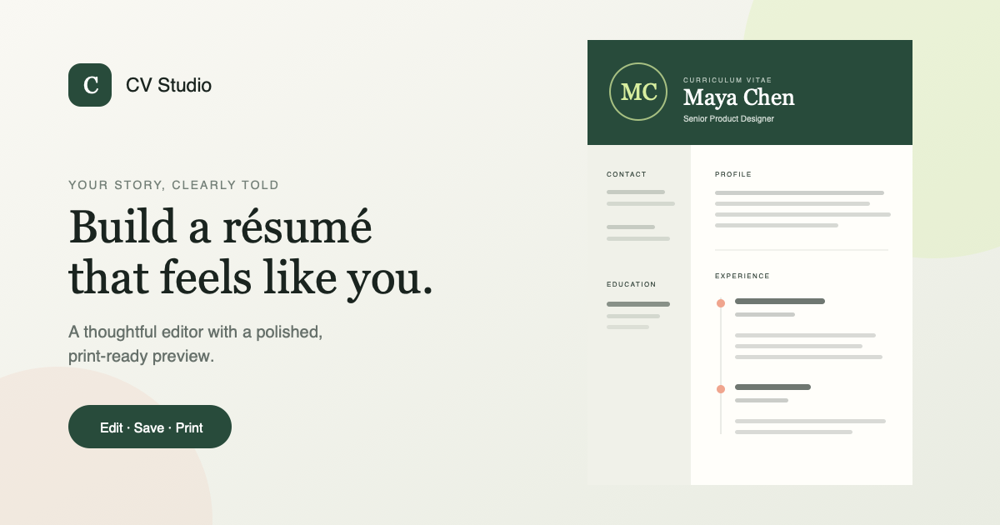

# CV Studio

[](https://miguelrcol.github.io/cv-studio/)
[](https://github.com/MiguelRcol/cv-studio/actions/workflows/deploy.yml)

A calm, responsive CV builder that turns structured career details into a polished, print-ready résumé. Built as a React state-management project for [The Odin Project](https://www.theodinproject.com/).

[Open the live application](https://miguelrcol.github.io/cv-studio/)



## Highlights

- Independent draft and saved state, so unfinished edits never alter the résumé
- Reusable education and experience entries with add, remove, and undo controls
- Clear month-range validation with focus management and field-level messages
- Semantic forms, persistent labels, keyboard focus styles, and polite status updates
- Responsive editor and preview across desktop, tablet, and mobile layouts
- A4 print stylesheet for exporting a clean PDF from the browser
- No account, server, or database required; data remains in the current browser session

## Built with

- React 19 and TypeScript
- Vite 8
- Custom responsive CSS
- Vitest and Testing Library
- GitHub Actions and GitHub Pages

## Architecture

```text
src/
├── components/
│   ├── CVBuilder.tsx          # Editor state, forms, validation, save/edit flow
│   ├── ResumePreview.tsx      # Semantic résumé output
│   └── types.ts               # Shared data models
├── styles/
│   ├── global.css             # Reset and global tokens
│   └── cv-builder.css         # Responsive UI and print presentation
├── test/setup.ts              # Browser test environment
├── App.tsx
└── main.tsx
```

Each section maintains a draft separately from its saved data. Submitting a form commits only that section, while Cancel restores its last saved values. This keeps the interaction predictable and demonstrates controlled inputs, immutable state updates, props, and conditional rendering.

## Run locally

```bash
git clone https://github.com/MiguelRcol/cv-studio.git
cd cv-studio
npm install
npm run dev
```

Vite prints the local URL in the terminal.

## Quality checks

```bash
npm run check
```

This runs linting, interaction tests, TypeScript validation, and the production build.

## Deployment

Every push to `main` runs the verification suite and publishes the generated `dist/` directory through GitHub Pages.

## License

Released under the [MIT License](LICENSE).
